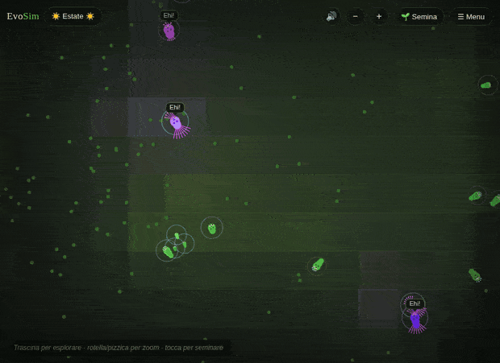

# 🌿 EvoSim — A Living Ecosystem

An artificial-life simulation that runs entirely in the browser. Creatures are
born, grow, graze, hunt, flee, call to one another, cooperate, reproduce and
**evolve** — guided by nothing but natural selection. No behaviour is scripted:
it all emerges.

**▶ Live:** https://francescoperrelli.github.io/evosim/
**✨ Project page:** https://francescoperrelli.github.io/evosim/about.html

A guided tour greets first-time visitors and reveals the layers step by step; you
can reopen it any time from the menu (📖 Tutorial).



## What's inside

- **Evolving neural brains** — each creature is steered by a small recurrent
  network with directional vision, memory and signalling channels. Its **hidden
  layer can grow or shrink by mutation** (with a metabolic cost), so intelligence
  itself evolves where it pays.
- **Lifetime learning** — on top of evolution, each creature carries a small
  plastic overlay that is reinforced (reward-modulated Hebbian learning) whenever
  it feeds or hunts, so it *adapts within its own life*. The overlay isn't
  inherited — offspring start blank and relearn — so genes that make learning
  pay get selected (the Baldwin effect).
- **An evolving diet** — diet is a continuous gene (herbivore → omnivore →
  carnivore); a lineage can shift its whole feeding strategy over generations.
- **Bodies that evolve** — creatures are drawn from their genome: eyes scale with
  vision, legs with speed, the body segments/elongates with a shape gene, markings
  come from a pattern gene, carnivores grow a mouth. Watch them transform as they
  evolve.
- **Life stages** — creatures are born as small juveniles and grow to adult size;
  juveniles can't reproduce.
- **Two reproduction modes** — cloning (asexual) and mating with genome + brain
  **crossover** (sexual), with mate-seeking behaviour. Partners must be genetically
  compatible, so **reproductive isolation and speciation** can emerge.
- **A proto-language** — communication is no longer a single call but **three
  brain-controlled channels** with matching heard-signal inputs. Their meanings
  are free to evolve (channel 0 keeps an innate alarm role); an **emergent-lexicon
  meter** measures, live across the population, how each channel correlates with
  context (threat / prey / food / crowd) — so you can read what each evolved "word"
  has come to mean.
- **Regional dialects** — each dominant lineage develops its own "accent": the
  average signal it emits in a shared, relaxed reference context. The evolution
  panel shows the dominant lineages' accent swatches and a live divergence score,
  so you can watch linguistic diversity split lineage from lineage.
- **Ornaments & selection on looks** — every creature carries heritable *ornament*
  and *preference* genes, expressed as a vivid coat, a head-crown and a tail-fan
  that all grow with the ornament (and cost energy to carry). Each kind is under a
  different pressure: the sexual species runs **sexual selection** (choosy partners
  favour showier mates — Fisherian runaway, with ornament and preference inherited
  as a linked pair so the correlation can build); **carnivores** run **contest
  selection** (yielding to a showier rival costs energy, so intimidation armaments
  escalate); **herbivores** run **social selection** (showier individuals gather a
  flock around them — safety in numbers — but are easier for predators to spot, so
  the display settles at a balance). When sexual ornaments run away, the chronicle
  says so.
- **Cooperation** — an altruism gene lets the well-fed share energy with starving
  kin; carnivores hunting near allies get a pack bonus; alarm calls warn the herd.
- **Cultural transmission** — a newborn can imitate the brain of the most thriving
  same-type neighbour of its parent (not just kin), so a successful behaviour can
  spread horizontally through a population faster than genes alone.
- **Pheromone trails (stigmergy)** — each species lays a faint scent field as it
  moves; others drift up the gradient of their own kind, so paths and gathering
  points form on their own. Shown as soft coloured trails.
- **Emergent nests** — where a kind repeatedly gathers, a persistent home site
  crystallises out of the scent field (up to five per species). The young keep
  close to a home of their kind and are harder for predators to pick off while
  they shelter there.
- **Flocks, territories, mimicry** — herding, patrolled dens, and a camouflage vs.
  acuity arms race.
- **A world that matters** — biomes (fertile/barren), water and rocks, seasons and
  a day/night cycle.
- **Play-god events** — meteors, droughts, epidemics.
- **Co-evolving disease** — a pathogen strain carries *evolvable* virulence and
  transmissibility and mutates as it jumps hosts, while hosts carry a heritable
  *resistance* gene: virulence settles at an intermediate level, resistance rises
  to meet it, and infection waxes and wanes — a Red Queen arms race. Unleash a
  one-off epidemic from Events, or switch on endemic plagues in Options.
- **Deep observability** — inspector with genome, live neural network, current
  "thought" and a navigable genealogy; an Evolution panel with average generation,
  brain size, diet distribution, dominant lineages, live **species count**,
  cooperation stats, the **emergent-lexicon** heat grid, per-lineage **dialects**,
  and **average ornament per species over time** (so you can watch the three
  selection regimes diverge: omnivore sexual runaway, carnivore contest, herbivore
  social balance). A **CSV export** (Options) dumps the whole run's timeline —
  populations, generations, brain size, ornaments, resistance, infection, dialect
  divergence — for analysis outside the browser.
- **A chronicle** — a running 📜 diary that logs notable events (generation
  milestones, extinctions and returns, population booms and crashes, brain-size
  records, new species diversity, challenge outcomes) so you can read back the
  story of a world you left running.
- **Thought bubbles** — an honest narrative layer: ambient bubbles and the
  inspector verbalize each creature's *real* internal state (they don't invent it).
- **Challenge mode** — eight objectives, including cooperation-driven ones
  (Society, Adaptive radiation, The pack).
- **Reproducible, shareable worlds** — every world is grown from a **seed**; open
  `?seed=123456` to load that exact world, or copy a share link from the Options
  panel. Same seed → the same world, every time.
- **Named save slots**, ambient music & sound effects, a pannable/zoomable world
  backed by a spatial grid, Italian / English, and browser auto-save.

## How to use it

Open the live link (works on desktop and phone). Drag to explore, wheel/pinch to
zoom, tap to grow plants. Switch to **🔍 Inspect** (top-right) and tap a creature
to open its genome, brain, thought and genealogy. The side panel opens
**📊 Evolution**, **⚡ Events** and **🎯 Challenges**; the menu has **📁 Save slots**.

## Tests

A headless suite checks the core invariants — determinism (same seed → identical
world), ecosystem survival over a long run, save/load round-trips, and v8→v9
brain migration — by driving the real page with Playwright/Chromium.

```
npm install
npx playwright install chromium
npm test
```

(In an environment with a preinstalled browser, point `CHROMIUM_PATH` at the
binary instead of running `playwright install`.)

## Project structure

```
index.html            markup only
css/style.css          all styling
js/
  utils.js             shared helpers
  state.js             parameters, world state, camera, seasons, day/night, species helpers
  nn.js                recurrent neural network with an evolvable hidden size
  genome.js            genome (diet, morphology, altruism…), mutation/crossover, creatures, aging
  world.js             simulation engine (grid, perception, cooperation, terrain, events, speciation) + save/load
  render.js            drawing, camera, morphology, charts, network & genealogy viz, thought bubbles
  challenges.js        challenge definitions and live evaluation
  audio.js             synthesized ambient music and sound effects
  saves.js             named save slots
  i18n.js              Italian / English translations
  ui.js                overlays, controls, inspector, genealogy, tools
  main.js              bootstrap, animation loop, auto-save
```

Native ES modules — open through the live URL (or any static web server), not
`file://`.

## Publishing

Hosted with GitHub Pages from `main`. Any push updates the live site within ~a
minute.

---

Built as an experiment in *artificial life* — genetic algorithms, evolving neural
networks, communication, cooperation and emergent behaviour.
