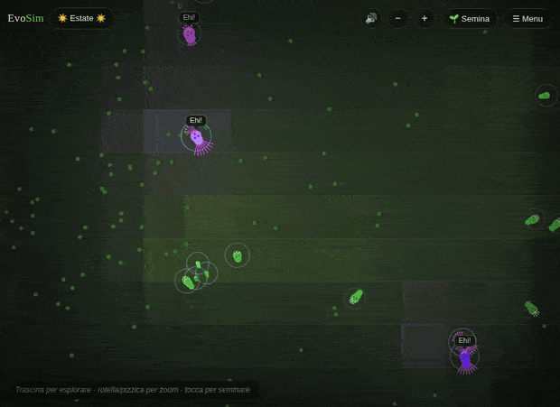

# 🌿 EvoSim — A Living Ecosystem

An artificial-life simulation that runs entirely in the browser. Creatures are
born, grow, graze, hunt, flee, call to one another, cooperate, reproduce and
**evolve** — guided by nothing but natural selection. No behaviour is scripted:
it all emerges.

**▶ Live:** https://francescoperrelli.github.io/evosim/
**✨ Project page:** https://francescoperrelli.github.io/evosim/about.html

A guided tour greets first-time visitors and reveals the layers step by step; you
can reopen it any time from the menu (📖 Tutorial).



## What's inside

- **Evolving neural brains** — each creature is steered by a small recurrent
  network with directional vision, memory and signalling channels. Its **hidden
  layer can grow or shrink by mutation** (with a metabolic cost), so intelligence
  itself evolves where it pays.
- **Lifetime learning — a faculty this world cannot see** — on top of evolution,
  each creature carries a small plastic overlay, reinforced (reward-modulated
  Hebbian learning) whenever it feeds or hunts. It genuinely accumulates that one
  individual's experience, it is individually specific, and it is inherited by
  nobody — offspring start blank and relearn. It also changes nothing. Across
  twenty experimental arms — motor frame fixed, the brain-versus-instinct balance
  swept out to 4× the instinct weight, and a proper policy-gradient rule building
  an overlay 15× larger tried on top — per-body income sits at 0.50 everywhere,
  and the classic Baldwin assay comes back flat. Selection here is too
  coarse-grained to tell a well-steered forager from an averagely-steered one.
  You are watching a mind that works and does not pay.
- **An evolving diet** — diet is a continuous gene (herbivore → omnivore →
  carnivore); a lineage can shift its whole feeding strategy over generations.
- **Bodies that evolve** — creatures are drawn from their genome: eyes scale with
  vision, legs with speed, the body segments/elongates with a shape gene, markings
  come from a pattern gene, carnivores grow a mouth. Watch them transform as they
  evolve.
- **Life stages** — creatures are born as small juveniles and grow to adult size;
  juveniles can't reproduce.
- **Two reproduction modes** — cloning (asexual) and mating with genome + brain
  **crossover** (sexual), with mate-seeking behaviour. Partners must be genetically
  compatible, so **reproductive isolation and speciation** can emerge.
- **A proto-language** — communication is no longer a single call but **three
  brain-controlled channels** with matching heard-signal inputs. Their meanings
  are free to evolve (channel 0 keeps an innate alarm role); an **emergent-lexicon
  meter** measures, live across the population, how each channel correlates with
  context (threat / prey / food / crowd) — so you can read what each evolved "word"
  has come to mean.
- **Regional dialects** — each dominant lineage develops its own "accent": the
  average signal it emits in a shared, relaxed reference context. The evolution
  panel shows the dominant lineages' accent swatches and a live divergence score,
  so you can watch linguistic diversity split lineage from lineage.
- **Ornaments & selection on looks** — every creature carries heritable *ornament*
  and *preference* genes, expressed as a vivid coat, a head-crown and a tail-fan
  that all grow with the ornament (and cost energy to carry). Each kind is under a
  different pressure: the sexual species runs **sexual selection** (choosy partners
  favour showier mates — Fisherian runaway, with ornament and preference inherited
  as a linked pair so the correlation can build); **carnivores** run **contest
  selection** (yielding to a showier rival costs energy, so intimidation armaments
  escalate); **herbivores** run **social selection** (showier individuals gather a
  flock around them — safety in numbers — but are easier for predators to spot, so
  the display settles at a balance). When sexual ornaments run away, the chronicle
  says so — and they run away only sometimes: against matched controls both the
  ornament and preference genes drift, so a runaway is a stochastic excursion you
  get to witness, not a scheduled outcome.
- **Cooperation** — an altruism gene lets the well-fed share energy with starving
  kin; carnivores hunting near allies get a pack bonus; alarm calls warn the herd.
  A **reciprocity** gene extends helping to non-kin who reciprocate (and cuts off
  cheaters via a small partner ledger).
- **Niche construction — foraging & caching** — a **hoard** gene lets a well-fed
  creature pocket surplus food and deposit it into a **granary** (a built resource
  store); kin draw from the family granary through scarcity. Only kin can use it,
  so the payoff runs through kin selection — though measured against a matched
  control the gene itself drifts rather than climbing.
- **Niche construction — shelters** — a **build** gene lets prey spend energy to
  raise a **thicket shelter** (a leafy dome): it snags pursuing predators, and kin
  hiding inside their family's shelter are much harder to catch. A second kind of
  built structure, again lineage-tagged so building pays for one's own kin.
  Together with caching, creatures interact with the environment, collect resources
  and build things — all emergent, not scripted.
- **Cultural transmission — a channel carrying content nobody can eat** — a
  newborn can imitate the brain of the most thriving same-type neighbour of its
  parent (not just kin), and parents teach their young directly. The channel
  demonstrably carries *specific* content, not just bandwidth: it beats
  same-fidelity random noise by a factor of 1.7, consistently across seeds. And
  it buys nothing at all — income is 0.50 in all four arms (real teaching, random
  content, cost-only, mechanic off), and the transmission-fidelity gene never
  beats its own drift control. A faithful inheritance channel with no fitness
  consequence whatsoever is a stranger result than a working one, and it is the
  honest state of culture here.
- **Marks on the ground — a working channel, no convention** — a creature can
  leave one of three persistent glyphs where something mattered, and others read
  them off the soil. The channel is real and the content is recoverable: decode
  error 0.084 against 0.501 for a scrambled control. What has *not* emerged is
  agreement about which glyph stands for what — a shuffled-glyph control is
  statistically indistinguishable from the real thing (0.824 ± 0.033 vs
  0.846 ± 0.047), and even making the mistake lethal (reading danger as forage)
  changed nothing. Shipped because it is worth watching, and described for what
  it is rather than what it looked like.
- **Tools, fire and techniques** — a stone picked up on scree and carried away
  opens armoured fruit; **fire** scorches ground that pays back richer hundreds
  of ticks later; four **techniques** pass from body to body and are lost when
  nobody is left to teach them. The glyph vocabulary and the technique list are
  finite and written by us — what is genuinely open is who holds what, in what
  order, for how long, and whether they lose it.
- **Terraforming — and a lesson about run length** — a **terra** gene lets a
  creature raise the fertility of the ground it stands on at its own expense.
  This one *is* selected, and it is the clearest thing the project has learned
  about itself: paired against a no-payoff control over three seeds, the gap
  reaches +0.232 by 35–40k ticks and is positive in every window from 10k on.
  It sat archived as "drift" for a long time on 14k-tick runs, because **the
  signal does not exist before ~20 000 ticks and is unambiguous only after
  25 000**. Selection here answers on the scale of tens of thousands of ticks;
  short runs lie.
- **Four planets** — separated by void, with interplanetary dispersal that is
  evolved rather than scripted, and events that strike one world and not the
  others, so the planets never quite converge.
- **Settlements, property and coalitions** — persistent **villages** with a
  division of labour, a property / theft / **altruistic punishment** layer where
  punishing costs the punisher, mineral **trade**, and inter-group **coalitions**.
  Each sits behind its own toggle in Options.
- **Pheromone trails (stigmergy)** — each species lays a faint scent field as it
  moves; others drift up the gradient of their own kind, so paths and gathering
  points form on their own. Shown as soft coloured trails.
- **Emergent nests** — where a kind repeatedly gathers, a persistent home site
  crystallises out of the scent field (up to five per species). The young keep
  close to a home of their kind and are harder for predators to pick off while
  they shelter there.
- **Flocks, territories, mimicry** — herding, patrolled dens, and a camouflage
  vs. acuity pairing that the Evolution panel charts live. Both genes are read by
  the predator's detection roll, but against a matched control neither one
  actually climbs: the arms race is plotted, not won.
- **A world that matters** — biomes (fertile/barren), water and rocks, seasons and
  a day/night cycle.
- **Seasonal migrations** — the productive "sunlit" latitude drifts north and south
  across the year, so where food is richest moves with the season; herds follow it
  (a heritable migration gene makes the pull evolvable), and over a year the herd's
  position tracks the sun (~0.85 correlation in testing).
- **Play-god events** — meteors, droughts, epidemics.
- **Co-evolving disease** — a pathogen strain carries *evolvable* virulence and
  transmissibility and mutates as it jumps hosts, while hosts carry a heritable
  *resistance* gene: virulence settles at an intermediate level and infection
  waxes and wanes. The host side of the Red Queen is the part that hasn't
  arrived — against its own control the resistance gene drifts rather than
  climbing to meet the pathogen. Endemic plagues ship **off**; unleash a one-off
  epidemic from Events, or switch them on in Options.
- **Deep observability** — inspector with genome, live neural network, current
  "thought" and a navigable genealogy; an Evolution panel with average generation,
  brain size, diet distribution, dominant lineages, live **species count**,
  cooperation stats, the **emergent-lexicon** heat grid, per-lineage **dialects**,
  and **average ornament per species over time** (so you can watch the three
  selection regimes diverge: omnivore sexual runaway, carnivore contest, herbivore
  social balance). A **CSV export** (Options) dumps the whole run's timeline —
  populations, generations, brain size, ornaments, resistance, infection, dialect
  divergence — for analysis outside the browser.
- **A chronicle** — a running 📜 diary that logs notable events (generation
  milestones, extinctions and returns, population booms and crashes, brain-size
  records, new species diversity, challenge outcomes) so you can read back the
  story of a world you left running.
- **Thought bubbles** — an honest narrative layer: ambient bubbles and the
  inspector verbalize each creature's *real* internal state (they don't invent it).
- **Challenge mode** — eight objectives, including cooperation-driven ones
  (Society, Adaptive radiation, The pack).
- **Reproducible, shareable worlds** — every world is grown from a **seed**; open
  `?seed=123456` to load that exact world, or copy a share link from the Options
  panel. Same seed → the same world, every time.
- **Installable PWA** — add it to your home screen and it runs **offline**; a
  service worker caches the whole app shell.
- **Named save slots**, ambient music & sound effects, a pannable/zoomable world
  backed by a spatial grid, Italian / English, and browser auto-save.

## How to use it

Open the live link (works on desktop and phone). Drag to explore, wheel/pinch to
zoom, tap to grow plants. Switch to **🔍 Inspect** (top-right) and tap a creature
to open its genome, brain, thought and genealogy. The side panel opens
**📊 Evolution**, **⚡ Events** and **🎯 Challenges**; the menu has **📁 Save slots**.

## Tests

**23 headless checks** drive the real page with Playwright/Chromium, so they
exercise the actual shipped modules: clean load, determinism (same seed →
identical world), ecosystem survival over a long run, save/load round-trips,
v8→v9 brain migration, each level-3 mechanic being deterministic and non-lethal
on its own, culture *not* leaking into the germline, multi-planet confinement,
cross-void dispersal, and husbandry.

```
npm install
npx playwright install chromium
npm test
```

(In an environment with a preinstalled browser, point `CHROMIUM_PATH` at the
binary instead of running `playwright install`.)

## Project structure

```
index.html            markup only
css/style.css          all styling
js/
  utils.js             shared helpers
  state.js             parameters, world state, camera, seasons, day/night, species helpers
  nn.js                recurrent neural network with an evolvable hidden size
  genome.js            genome (38 serialised fields), mutation/crossover, creatures, aging
  world.js             simulation engine (grid, perception, cooperation, terrain, events, speciation) + save/load
  flora.js             plant genomes and toxins
  render.js            drawing, camera, morphology, charts, network & genealogy viz, thought bubbles
  phylo.js             lineage tracking, speciation and the tree of life
  culture.js           vertical transmission and lifetime-learning overlay
  tools.js             carried stones and armoured fruit
  fire.js              ignition, burning fronts, scorched ground and ash
  marks.js             the three persistent ground glyphs
  tech.js              the four transmitted techniques
  terra.js             ground improvement and diverging planets
  village.js           persistent settlements and division of labour
  property.js          ownership, theft and altruistic punishment
  trade.js             minerals and exchange
  tribe.js             coalitions and intergroup conflict
  challenges.js        challenge definitions and live evaluation
  audio.js             synthesized ambient music and sound effects
  saves.js             named save slots
  i18n.js              Italian / English translations
  ui.js                overlays, controls, inspector, genealogy, tools
  main.js              bootstrap, animation loop, auto-save
```

Roughly 12 000 lines of native ES modules, no build step. Each of the level-3
mechanics above ships behind its own toggle and has been measured against a
control — the verdicts, including the negative ones, live in a log at the foot of
the file that produced them, and `ROADMAP.md` indexes them.

Native ES modules — open through the live URL (or any static web server), not
`file://`.

## Publishing

Hosted with GitHub Pages from `main`. Any push updates the live site within ~a
minute.

---

Built as an experiment in *artificial life* — genetic algorithms, evolving neural
networks, communication, cooperation and emergent behaviour.
